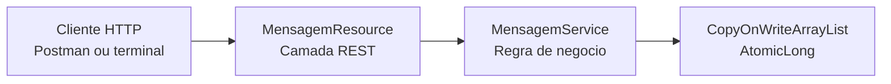
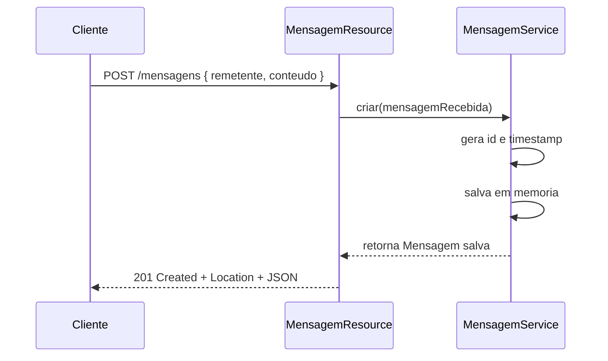

# Quarkus Mensageria Distribuida

## Objetivo do trabalho

Este projeto demonstra uma mensageria simples baseada em HTTP usando Quarkus. O foco nao esta em fila, broker ou processamento assincrono. O objetivo e mostrar, de forma clara, como um cliente envia dados para um servidor REST, como o servidor responde com codigos HTTP adequados e como esse fluxo pode ser explicado teoricamente como operacoes de `send` e `receive`.

## Escopo e premissas

- Idioma da entrega: portugues do Brasil.
- Sem banco de dados, autenticacao, Docker, broker, fila ou persistencia externa.
- Armazenamento inteiramente em memoria com `CopyOnWriteArrayList<Mensagem>`.
- Identificador sequencial gerado no servidor por `AtomicLong`.
- `timestamp` gerado no servidor com `LocalDateTime.now()`.
- Base tecnica confirmada em 05/04/2026 nas documentacoes oficiais do Quarkus.

## Arquitetura da solucao

O projeto foi criado com o starter oficial do Quarkus e Maven Wrapper, sem depender de Maven global. A API usa `Quarkus REST + Jackson` para expor endpoints JSON, mas o codigo continua com as anotacoes JAX-RS (`jakarta.ws.rs`), o que e coerente com a recomendacao atual da plataforma.



## Fluxo do `POST /mensagens`



Resumo do fluxo:

1. O cliente envia um JSON contendo `remetente` e `conteudo`.
2. O `MensagemResource` recebe a requisicao e delega a logica para o `MensagemService`.
3. O `MensagemService` cria uma nova instancia de `Mensagem`, atribui `id` e `timestamp` no servidor e armazena em memoria.
4. O `MensagemResource` devolve `201 Created`, inclui `Location` com o URI do novo recurso e retorna o JSON persistido.

## Mapeamento teorico: `send` e `receive`

| Operacao | O que o cliente envia (`send`) | O que o cliente recebe (`receive`) |
| --- | --- | --- |
| `GET /mensagens` | Uma requisicao pedindo o estado atual da lista | Uma lista JSON com todas as mensagens armazenadas |
| `GET /mensagens/{id}` | Um identificador para consultar uma mensagem especifica | O JSON da mensagem ou `404 Not Found` |
| `POST /mensagens` | Um JSON com os dados essenciais da mensagem | O JSON salvo com `id`, `timestamp` e `Location` |
| `DELETE /mensagens/{id}` | Uma requisicao de remocao para um identificador | O JSON removido ou `404 Not Found` |

## Tipo publico da API

O tipo central da API e `Mensagem`:

| Campo | Tipo | Origem |
| --- | --- | --- |
| `id` | `Long` | Gerado no servidor |
| `remetente` | `String` | Recebido do cliente |
| `conteudo` | `String` | Recebido do cliente |
| `timestamp` | `LocalDateTime` | Gerado no servidor |

## Tabela de endpoints

| Metodo | Endpoint | Descricao | Sucesso | Erro principal |
| --- | --- | --- | --- | --- |
| `GET` | `/mensagens` | Lista todas as mensagens em memoria | `200 OK` | - |
| `GET` | `/mensagens/{id}` | Busca uma mensagem por id | `200 OK` | `404 Not Found` |
| `POST` | `/mensagens` | Cria uma nova mensagem | `201 Created` | - |
| `DELETE` | `/mensagens/{id}` | Remove uma mensagem por id | `200 OK` | `404 Not Found` |

## Decisoes tecnicas

### 1. Quarkus REST + Jackson

Foi usada a extensao `io.quarkus:quarkus-rest-jackson`, recomendada atualmente pelo Quarkus para APIs REST com JSON. O codigo continua usando JAX-RS, mas o runtime em uso e o Quarkus REST. A documentacao oficial de `RESTEasy Classic` hoje aparece como stack legada, o que justifica a escolha.

### 2. `MensagemService` separado do resource

O `MensagemResource` ficou responsavel apenas por HTTP, enquanto o `MensagemService` concentra regra e armazenamento. Essa separacao facilita testes, leitura e manutencao.

### 3. `CopyOnWriteArrayList` + `AtomicLong`

- `CopyOnWriteArrayList` simplifica o armazenamento em memoria com seguranca para acesso concorrente em um cenario pequeno e didatico.
- `AtomicLong` resolve a geracao sequencial de ids sem banco de dados.

### 4. Persistencia em memoria

Essa decisao foi intencional para manter o foco no conceito de comunicacao HTTP entre processos. O efeito colateral esperado e que os dados somem quando a aplicacao reinicia, o que e aceitavel para o objetivo academico.

## Justificativa dos status codes

| Endpoint | Status | Justificativa |
| --- | --- | --- |
| `GET /mensagens` | `200 OK` | A operacao sempre retorna uma representacao valida da lista, mesmo vazia |
| `GET /mensagens/{id}` | `200 OK` | O recurso solicitado foi encontrado e retornado |
| `GET /mensagens/{id}` | `404 Not Found` | O identificador nao existe na lista em memoria |
| `POST /mensagens` | `201 Created` | Um novo recurso foi criado com sucesso no servidor |
| `DELETE /mensagens/{id}` | `200 OK` | A remocao foi concluida e o recurso removido foi retornado no corpo |
| `DELETE /mensagens/{id}` | `404 Not Found` | Nao existe recurso para remover com o id informado |

## Testes automatizados

Os testes foram implementados com `@QuarkusTest` e `RestAssured`, seguindo a abordagem oficial do Quarkus para testes de integracao da API.

| Teste | Objetivo | Resultado esperado |
| --- | --- | --- |
| Lista vazia | Garantir o estado inicial em memoria | `200 OK` com `[]` |
| Criacao | Validar `POST /mensagens` | `201 Created`, `Location`, `id`, `timestamp` |
| Busca por id | Validar `GET /mensagens/{id}` com id valido | `200 OK` com JSON correto |
| Exclusao | Validar `DELETE /mensagens/{id}` com id valido | `200 OK` com JSON removido |
| Id inexistente | Validar consulta de recurso ausente | `404 Not Found` |
| Busca apos exclusao | Garantir consistencia depois do `DELETE` | `404 Not Found` |

Resultado da execucao local:

- Comando executado: `.\mvnw.cmd test`
- Total de testes: `6`
- Falhas: `0`
- Erros: `0`
- Build: `SUCCESS`

## Evidencias executadas

As evidencias foram capturadas em `05/04/2026`, com a aplicacao subindo em `localhost:8080` via `quarkus:dev`.

### Terminal

- [GET inicial](docs/evidencias/terminal/01-get-inicial.md)
- [POST criacao](docs/evidencias/terminal/02-post-criacao.md)
- [GET por id](docs/evidencias/terminal/03-get-por-id.md)
- [GET inexistente](docs/evidencias/terminal/04-get-inexistente.md)
- [DELETE por id](docs/evidencias/terminal/05-delete-por-id.md)
- [GET apos DELETE](docs/evidencias/terminal/06-get-apos-delete.md)

### Postman

- [Roteiro de validacao no Postman](docs/evidencias/postman/roteiro-validacao-postman.md)
- [Collection exportada](docs/postman/quarkus-mensagens.postman_collection.json)
- [Environment localhost:8080](docs/postman/localhost-8080.postman_environment.json)

## Comparacao breve: Quarkus vs Spring Boot

| Criterio | Quarkus | Spring Boot |
| --- | --- | --- |
| Tempo de inicializacao | Normalmente menor, com foco forte em cloud-native | Geralmente maior em comparacao |
| Consumo de memoria | Tende a ser mais enxuto | Tende a ser maior |
| Experiencia de desenvolvimento | `quarkus:dev` com live reload muito forte | `spring-boot-devtools` tambem ajuda, mas a proposta do Quarkus e mais agressiva em rapidez |
| Modelo de programacao | Muito parecido em APIs REST, CDI e anotacoes | Muito conhecido e difundido no ecossistema Java |
| Melhor uso didatico neste trabalho | Bom para mostrar REST moderno e inicializacao rapida | Seria uma alternativa valida, mas nao era o framework escolhido |

Resumo: para este trabalho, Quarkus ajuda porque sobe rapido, tem bom suporte a REST e testes, e deixa a demonstracao mais leve. Spring Boot tambem resolveria o problema, mas com outra proposta de runtime.

## Como executar

### Pre-requisitos

- JDK 21
- Maven Wrapper ja incluido no projeto
- Postman opcional para reproduzir as chamadas graficas

### Rodar em modo dev

```powershell
.\mvnw.cmd quarkus:dev
```

Aplicacao disponivel em:

- `http://localhost:8080/mensagens`

### Rodar testes

```powershell
.\mvnw.cmd test
```

## Estrutura principal do projeto

```text
.
|-- docs/
|   |-- evidencias/
|   |-- postman/
|   `-- relatorio-defesa.md
|-- output/
|   `-- pdf/
|-- src/
|   |-- main/java/br/com/otavi/quarkus/mensageria/
|   `-- test/java/br/com/otavi/quarkus/mensageria/
|-- mvnw
|-- mvnw.cmd
`-- pom.xml
```

## Referencias oficiais

- Quarkus Getting Started: <https://quarkus.io/guides/getting-started>
- Quarkus REST Jackson: <https://quarkus.io/extensions/io.quarkus/quarkus-rest-jackson/>
- Testing Your Application: <https://quarkus.io/guides/getting-started-testing>
- RESTEasy Classic note: <https://quarkus.io/guides/resteasy>
